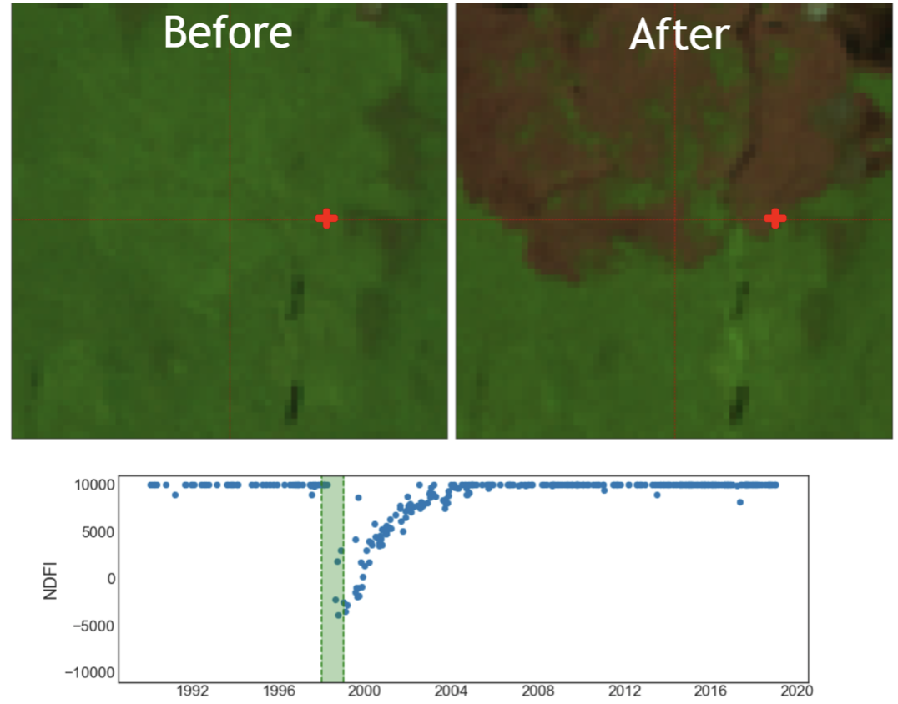

.. Test1docs documentation master file, created by
   sphinx-quickstart on Sat Jul 31 12:19:14 2021.
   You can adapt this file completely to your liking, but it should at least
   contain the root `toctree` directive.

**Welcome to Test1docs's documentation!**
=========================================

.. toctree::
   :maxdepth: 2
   :caption: Contents:

Indices and tables
==================

* :ref:`genindex`
* :ref:`modindex`
* :ref:`search`

###############
Getting Started
###############
Let's talk about interpretation keys

---------------------
What Tables Look Like
---------------------

+------------------------+------------+----------+----------+
| Header row, column 1   | Header 2   | Header 3 | Header 4 |
| (header rows optional) |            |          |          |
+========================+============+==========+==========+
| body row 1, column 1   | column 2   | column 3 | column 4 |
+------------------------+------------+----------+----------+
| body row 2             | ...        | ...      |          |
+------------------------+------------+----------+----------+

-------------------------
Test, Does this update???
-------------------------

.. [#f1] Footnote example - Crystal is the author
